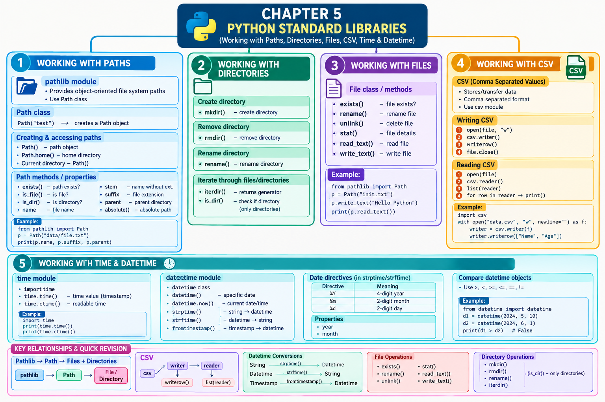

# LJ-Python-sem3-chapter5-explained
# STEP 1 — DEEP EXPLANATION

# Chapter 5: Python Standard Libraries

According to the PPT, this chapter focuses on **Python Standard Libraries**, especially working with:

1. Paths
    
2. Directories
    
3. Files
    
4. CSV files
    
5. Time
    
6. Date and datetime
    

The first section introduces how Python handles files and directories and why Python distinguishes between **text files and binary files**.

---

# 1. Working with Paths, Files and Directories

Python provides facilities for **file handling**. This means Python programs can work with files in many ways, such as:

- Reading files
    
- Writing files
    
- Checking whether files exist
    
- Renaming files
    
- Deleting files
    
- Working with directories
    
- Getting information about files
    

The PPT introduces these operations through Python's standard libraries.

### What is a file?

A **file** is a collection of data stored on a computer under a particular name and location.

For example:

```text
D:\testmodule\test.txt
```

Here:

```text
D:              → Drive
testmodule      → Directory
test.txt        → File
```

A Python program can use the path to locate and work with this file.

---

# 2. Text Files and Binary Files

The PPT specifically points out that Python treats files differently as **text or binary**, and this distinction is important.

## Text File

A text file contains characters that represent readable text.

Examples:

```text
.txt
.py
.csv
```

For example:

```text
Hello
Welcome to Python
```

A text file consists of sequences of characters.

### End of Line — EOL

Each line in a text file ends with a special character called an **EOL (End of Line)** character.

The EOL tells the interpreter that:

> The current line has ended and a new line has started.

Conceptually:

```text
Line 1
   ↓
[EOL]
   ↓
Line 2
   ↓
[EOL]
   ↓
Line 3
```

The PPT mentions newline characters as an example of an EOL character.

### ⭐ Exam Point

**EOL = End of Line**

It indicates the termination of the current line and the beginning of another line.

---

# 3. Python Standard Libraries

Python provides many modules as part of its **standard library**.

A standard library is a collection of modules that provide commonly required functionality.

In this chapter, the PPT focuses on libraries/modules for:

```text
Python Standard Libraries
        │
        ├── Working with Paths
        │
        ├── Working with Directories
        │
        ├── Working with Files
        │
        ├── Working with CSV
        │
        └── Working with Time & Date
```

---

# 4. Working with Paths

The PPT introduces the **pathlib module** for working with paths.

## What is pathlib?

`pathlib` is a Python module that provides classes for representing **file system paths**.

One important advantage mentioned in the PPT is that these path classes have semantics appropriate for **different operating systems**.

So instead of manually manipulating path strings, we can use objects provided by `pathlib`.

### Important exam definition

> **Pathlib** is a Python module that provides various classes representing file system paths with semantics appropriate for different operating systems.

---

# 5. Path Class

The **Path class** is described in the PPT as the basic building block for working with files and directories.

To use the `Path` class:

```python
from pathlib import Path
```

### Meaning

```text
pathlib module
      │
      └── Path class
             │
             ├── Files
             └── Directories
```

The `Path` object represents a path on the computer.

---

# 6. Creating a Path Object

A path object can represent a particular location.

The PPT gives an example similar to:

```python
from pathlib import Path

Path("C:\\Program Files\\Microsoft")
```

This creates a `Path` object representing that location.

Conceptually:

```text
Path("C:\\Program Files\\Microsoft")
                │
                ▼
       Path Object
                │
                ▼
C:\Program Files\Microsoft
```

### Important

A `Path` object represents the location. It allows Python to perform operations on that location.

---

# 7. Current Directory Using Path()

The PPT shows that we can create a `Path` object representing the **current directory** simply by using:

```python
Path()
```

The current directory means the directory from which the Python program is currently operating.

For example:

```text
Current directory
       │
       ▼
C:\Python\Projects
```

Then:

```python
Path()
```

represents that current location.

---

# 8. Home Directory — Path.home()

The PPT also explains that we can obtain the **home directory of the current user** using the `home()` method.

```python
Path.home()
```

Conceptually:

```text
Path.home()
     │
     ▼
User's Home Directory
```

For example, on a Windows system it may represent a user's directory such as:

```text
C:\Users\UserName
```

The exact location depends on the computer/user environment.

### ⭐ Exam Point

```python
Path()
```

→ Represents the current directory.

```python
Path.home()
```

→ Gets the home directory of the current user.

---

# 9. Path Object and Its Methods/Properties

The PPT next creates a path object:

```python
path = Path("D://testmodule/test.txt")
```

This represents the file:

```text
D://testmodule/test.txt
```

Once we have the `Path` object, we can use several methods and properties.

---

# 10. Checking Whether a Path Exists — exists()

The PPT uses:

```python
path.exist()
```

to check whether the path exists.

### Concept

```text
Path
 │
 ▼
Does it exist?
 │
 ├── Yes
 │
 └── No
```

The intended concept is checking whether the specified path exists.

### Exam Point

**Purpose:** Check whether a path exists.

---

# 11. Checking Whether Path Represents a File — is_file()

The PPT gives:

```python
path.is_file()
```

This checks whether the specified path represents a **file**.

Conceptually:

```text
Path
 │
 ▼
is_file()
 │
 ├── True  → It represents a file
 └── False → It does not represent a file
```

### Example

If:

```text
D://testmodule/test.txt
```

is an existing file:

```python
path.is_file()
```

would indicate that it is a file.

---

# 12. Checking Whether Path Represents a Directory — is_dir()

The PPT gives:

```python
path.is_dir()
```

This checks whether the path represents a **directory**.

Conceptually:

```text
Path
 │
 ▼
is_dir()
 │
 ├── True  → Directory
 └── False → Not a directory
```

---

# 13. File Name — name Property

The `name` property can be used to obtain the **file name** from a path.

```python
print(path.name)
```

For:

```text
D://testmodule/test.txt
```

the result is:

```text
test.txt
```

### Breakdown

```text
D://testmodule/test.txt
                    ↑
                   name
```

---

# 14. File Name Without Extension — stem

The PPT introduces the `stem` property.

```python
print(path.stem)
```

For:

```text
D://testmodule/test.txt
```

the stem is:

```text
test
```

because `.txt` is the extension.

### Difference

|Property|Result for `test.txt`|
|---|---|
|`name`|`test.txt`|
|`stem`|`test`|

### ⭐ Exam Point

**stem = file name without extension**

---

# 15. File Extension — suffix

The PPT explains that the `suffix` property is used to get the **extension** of a file.

```python
print(path.suffix)
```

For example:

```text
test.py
```

gives:

```text
.py
```

The PPT specifically mentions that the output will display `.py`.

### Path breakdown

```text
test.py
│   │
│   └── suffix → .py
└────── stem   → test
```

---

# 16. Parent Directory — parent

The `parent` property is used to get the **parent directory** of a path.

```python
print(path.parent)
```

For:

```text
D://testmodule/test.txt
```

the parent is:

```text
D://testmodule
```

Diagram:

```text
D://testmodule
       │
       └── test.txt
```

Here:

```text
test.txt
   │
   └── parent → D://testmodule
```

---

# 17. Absolute Path — absolute()

The PPT explains that the **absolute path** can be displayed using the `absolute()` method.

```python
print(path.absolute())
```

An absolute path gives the complete path from the root/drive location.

Example concept:

```text
Relative path:
test.txt

Absolute path:
D:\testmodule\test.txt
```

### ⭐ Exam Point

`absolute()` → obtains/displays the absolute path.

---

# PATH METHODS & PROPERTIES — QUICK REVISION

|Method/Property|Purpose|
|---|---|
|`Path()`|Represents current directory|
|`Path.home()`|Gets user's home directory|
|`exists()`|Checks whether path exists|
|`is_file()`|Checks whether path represents a file|
|`is_dir()`|Checks whether path represents a directory|
|`name`|Gets file name including extension|
|`stem`|Gets file name without extension|
|`suffix`|Gets file extension|
|`parent`|Gets parent directory|
|`absolute()`|Displays absolute path|

These operations are directly covered in the PPT.

---

# 18. Working with Directories

The next PPT section is **Working with Directories**.

A directory is a location used to organize files and other directories.

Example:

```text
test/
│
├── file1.txt
├── file2.py
└── data.csv
```

Python's `Path` object can be used to work with directories.

The PPT creates a path object:

```python
path = Path("test")
```

---

# 19. Creating a Directory — mkdir()

The PPT shows the `mkdir()` method for creating a directory:

```python
path.mkdir('name')
```

### Concept

```text
Path object
     │
     ▼
 mkdir()
     │
     ▼
New directory
```

The purpose is to create a directory.

---

# 20. Removing a Directory — rmdir()

The PPT gives:

```python
path.rmdir('name')
```

for removing a directory.

Conceptually:

```text
Existing Directory
       │
       ▼
    rmdir()
       │
       ▼
Directory removed
```

---

# 21. Renaming a Directory — rename()

A directory can be renamed using:

```python
path.rename("abc")
```

Example:

```text
Before:
test/

After:
abc/
```

### ⭐ Exam Point

`rename()` → changes the name of the path.

---

# 22. Iterating Through Files and Directories — iterdir()

The PPT explains that `iterdir()` can be used to iterate through all the **files and directories** inside a path.

Example:

```python
for p in path.iterdir():
    print(p)
```

### How it works

Suppose:

```text
test/
│
├── a.txt
├── b.py
└── data/
```

Then:

```python
for p in path.iterdir():
    print(p)
```

can iterate through:

```text
a.txt
b.py
data
```

Diagram:

```text
             test/
               │
       ┌───────┼────────┐
       ▼       ▼        ▼
     a.txt    b.py     data/
       ▲       ▲        ▲
       └───────┴────────┘
             iterdir()
```

---

# 23. Displaying Only Directories

The PPT then shows how to display only directories.

```python
for p in path.iterdir():
    if p.is_dir():
        print(p)
```

Here two concepts work together:

```text
iterdir()
   │
   ▼
All entries
   │
   ▼
is_dir()
   │
   ├── Directory → print
   └── File      → ignore
```

### Example

Suppose:

```text
test/
├── a.txt
├── b.py
├── images/
└── documents/
```

The loop prints:

```text
images
documents
```

because they are directories.

---

# 24. Working with Files

The next section is **Working with Files**.

The PPT explains that we can refer to a file using a `Path` class object.

Example:

```python
path = Path("D://testmodule/test.txt")
```

Once we have this object, we can perform different file operations.

---

# 25. Check Whether File Exists

The PPT uses:

```python
path.exists()
```

to check whether the file exists.

Concept:

```text
File path
    │
    ▼
exists()
    │
 ┌──┴──┐
 ▼     ▼
Yes    No
```

---

# 26. Rename a File — rename()

The PPT shows:

```python
path.rename("init.txt")
```

for renaming a file.

Example:

```text
Before:
test.txt

       ↓ rename()

After:
init.txt
```

---

# 27. Delete a File — unlink()

The PPT introduces the `unlink()` method to delete a file.

```python
path.unlink()
```

Concept:

```text
File
 │
 ▼
unlink()
 │
 ▼
Deleted
```

### ⭐ Exam Point

`unlink()` → deletes/removes a file.

---

# 28. File Information — stat()

The `stat()` method can be used to check the **details of a file**.

```python
print(path.stat())
```

The PPT therefore identifies `stat()` as the method for obtaining file details.

---

# 29. Reading a File — read_text()

The PPT explains that a text file can be read using `read_text()`.

```python
print(path.read_text())
```

Suppose `test.txt` contains:

```text
Hello All
Welcome to Python
```

Then:

```python
print(path.read_text())
```

reads the text stored in the file.

Flow:

```text
test.txt
   │
   ▼
read_text()
   │
   ▼
File contents
   │
   ▼
print()
   │
   ▼
Screen
```

---

# 30. Writing to a File — write_text()

The PPT explains that we can write into a file using `write_text()`.

```python
path.write_text("Hello All")
```

Concept:

```text
"Hello All"
     │
     ▼
write_text()
     │
     ▼
   File
```

So `write_text()` is used to write text into a file.

---

# FILE OPERATIONS — QUICK REVISION

|Method|Purpose|
|---|---|
|`exists()`|Check whether path/file exists|
|`rename()`|Rename file/path|
|`unlink()`|Delete a file|
|`stat()`|Get file details|
|`read_text()`|Read text from file|
|`write_text()`|Write text into file|

These operations are specifically presented in the PPT's file-handling section.

---

# 31. Working with CSV

The next major topic in the PPT is **Working with CSV**.

## What is CSV?

CSV stands for:

> **Comma Separated Values**

A CSV file stores values separated by commas.

Example:

```text
transaction_id,product_id,price
1000,1,5
1001,2,15
```

The PPT describes CSV files as a simple means to **store and transfer data**.

---

# 32. CSV Module

Python provides the `csv` module for working with CSV files.

Import it using:

```python
import csv
```

Structure:

```text
Python
 │
 └── csv module
       │
       ├── writer
       └── reader
```

---

# 33. Opening a CSV File for Writing

The PPT shows how to open a CSV file using Python's built-in `open()` function:

```python
file = open("data.csv", "w")
```

Here:

```text
data.csv
   │
   └── CSV file

"w"
 │
 └── write mode
```

The file is opened so that data can be written into it.

---

# 34. csv.writer()

The CSV module provides the `writer` method to write content into a CSV file.

```python
writer = csv.writer(file)
```

Flow:

```text
CSV file
   │
   ▼
csv.writer(file)
   │
   ▼
writer object
   │
   ▼
Write rows
```

---

# 35. Writing Rows into CSV

The PPT explains that the `writer` can be used to write **tabular data** into the CSV file.

For this, `writerow()` is used, and values are passed in the form of an array/list.

Example from the PPT:

```python
writer.writerow(["transaction_id", "product_id", "price"])
writer.writerow([1000, 1, 5])
writer.writerow([1001, 2, 15])
```

Then:

```python
file.close()
```

The resulting table conceptually becomes:

|transaction_id|product_id|price|
|--:|--:|--:|
|1000|1|5|
|1001|2|15|

The PPT states that this creates **three rows with three columns** in the CSV file.

### Important observation

The first row:

```python
["transaction_id", "product_id", "price"]
```

acts as the column headings.

---

# 36. Reading a CSV File

The PPT then explains how to read a CSV file using the `reader` method.

Example:

```python
file = open("data.csv")
reader = csv.reader(file)
reader = list(reader)

for row in reader:
    print(row)
```

### Working

```text
data.csv
   │
   ▼
open()
   │
   ▼
csv.reader()
   │
   ▼
Rows
   │
   ▼
for row
   │
   ▼
print(row)
```

Each row can be accessed through the loop.

For example:

```text
['transaction_id', 'product_id', 'price']
[1000, 1, 5]
[1001, 2, 15]
```

---

# CSV — IMPORTANT REVISION TABLE

|Concept|Code|
|---|---|
|Import CSV|`import csv`|
|Open for writing|`open("data.csv","w")`|
|Create writer|`csv.writer(file)`|
|Write row|`writer.writerow([...])`|
|Close file|`file.close()`|
|Read file|`csv.reader(file)`|
|Convert reader to list|`list(reader)`|

The writing and reading sequence above follows the PPT examples.

---

# 37. Working with Time and Datetime

The next major topic is **Working with time and datetime**.

The PPT introduces **two modules** that can be used to work with date and time:

```text
Date & Time
    │
    ├── time
    │
    └── datetime
```

---

# 38. time Module

The PPT gives an example using the `time` module.

First:

```python
import time
```

Then:

```python
time1 = time.time()
```

Next:

```python
curr = time.ctime(time1)
```

Finally:

```python
print("current time", curr)
```

### Flow

```text
import time
     │
     ▼
time.time()
     │
     ▼
Timestamp
     │
     ▼
time.ctime()
     │
     ▼
Readable date/time
     │
     ▼
print()
```

The PPT gives an example output:

```text
Wed Nov 23 14:40:52 2022
```

---

# 39. datetime Class

The PPT next introduces the `datetime` class from the `datetime` module.

Import:

```python
from datetime import datetime
```

This allows us to create and work with datetime objects.

---

# 40. Creating a Specific Date

A `datetime` object can be created by specifying:

- Year
    
- Month
    
- Day
    

Example:

```python
dt = datetime(2022, 12, 25)
print(dt)
```

Output:

```text
2022-12-25 00:00:00
```

Notice that the time is:

```text
00:00:00
```

because only year, month, and day were specified.

---

# 41. Current Date and Time — now()

The PPT explains that a `datetime` object representing the **current date and time** can be created using:

```python
dt = datetime.now()
print(dt)
```

The PPT's example output is:

```text
2022-11-23 09:32:02.429447
```

The exact output changes depending on when the program is executed.

### ⭐ Exam Point

```python
datetime.now()
```

→ Creates a datetime object representing the current date and time.

---

# 42. Converting String to Datetime — strptime()

Sometimes a date is provided as a **string**.

Example:

```text
2022/12/25
```

The PPT shows that we can convert it into a datetime object using `strptime()`.

```python
dt = datetime.strptime("2022/12/25", "%Y/%m/%d")
print(dt)
```

Output:

```text
2022-12-25 00:00:00
```

---

# 43. Date Formatting Directives

The format string:

```python
"%Y/%m/%d"
```

tells Python which part represents which portion of the date.

The PPT explains:

|Directive|Meaning|
|---|---|
|`%Y`|Four-digit year|
|`%m`|Two-digit month|
|`%d`|Two-digit date/day|

### Example

```text
2022/12/25
│    │  │
│    │  └── %d → day
│    └───── %m → month
└────────── %Y → year
```

### ⭐ Very Important

Remember:

```text
%Y → Year
%m → Month
%d → Day
```

---

# 44. Converting Datetime to String — strftime()

The PPT says `strftime()` does the **opposite** of `strptime()`.

```text
strptime()
String ──────────► Datetime

strftime()
Datetime ────────► String
```

The PPT gives:

```python
dt = datetime(2022,12,25)
print(dt.strftime("%Y/%m/%d"))
```

Output:

```text
2022/12/25
```

### ⭐ Exam Difference

|Method|Conversion|
|---|---|
|`strptime()`|String → Datetime|
|`strftime()`|Datetime → String|

This is one of the most important distinctions in this chapter.

---

# 45. Timestamp to Datetime — fromtimestamp()

The PPT also explains how to convert a **timestamp into a datetime object** using `fromtimestamp()`.

Example:

```python
import time

dt = datetime.fromtimestamp(time.time())
```

Conceptually:

```text
time.time()
    │
    ▼
Timestamp
    │
    ▼
datetime.fromtimestamp()
    │
    ▼
Datetime object
```

---

# 46. year and month Properties

A `datetime` object has properties such as:

```python
year
month
```

The PPT demonstrates:

```python
print(dt.year)
print(dt.month)
```

For the PPT's example, the output is:

```text
2022
11
```

So:

```text
dt.year
   ↓
2022

dt.month
   ↓
11
```

---

# 47. Comparing Two Datetime Objects

The PPT explains that two datetime objects can be compared to determine which date is greater.

Example:

```python
dt1 = datetime(2022,1,1)
dt2 = datetime(2022,12,25)

print(dt2 > dt1)
```

The PPT states that this prints **TRUE** because the date in `dt2` is greater than the date in `dt1`.

Conceptually:

```text
dt1                         dt2
2022-01-01                  2022-12-25
   │                            │
   └────────── compare ─────────┘
                    │
                    ▼
                dt2 > dt1
                    │
                    ▼
                  True
```

---

# ⭐ COMPLETE CHAPTER 5 CONCEPT FLOW SO FAR

```text
                 PYTHON STANDARD LIBRARIES
                          │
          ┌───────────────┼────────────────┐
          │               │                │
          ▼               ▼                ▼
       PATHS         DIRECTORIES          FILES
          │               │                │
          │               ├── mkdir()      ├── exists()
          │               ├── rmdir()      ├── rename()
          │               ├── rename()     ├── unlink()
          │               └── iterdir()    ├── stat()
          │                               ├── read_text()
          │                               └── write_text()
          │
          ├── Path()
          ├── Path.home()
          ├── exists()
          ├── is_file()
          ├── is_dir()
          ├── name
          ├── stem
          ├── suffix
          ├── parent
          └── absolute()
          
                          │
          ┌───────────────┴────────────────┐
          ▼                                ▼
         CSV                         TIME & DATETIME
          │                                │
          ├── import csv                   ├── time
          ├── writer                       │    ├── time()
          ├── writerow()                   │    └── ctime()
          ├── reader                       │
          └── list(reader)                 └── datetime
                                               ├── datetime()
                                               ├── now()
                                               ├── strptime()
                                               ├── strftime()
                                               ├── fromtimestamp()
                                               ├── year
                                               └── month
```

---

# Chapter Summary

**Python Standard Libraries** provide built-in functionality for common programming tasks.

### 1. Paths

The `pathlib` module and `Path` class are used to represent and manipulate file-system paths.

Important features:

```python
Path()
Path.home()
exists()
is_file()
is_dir()
name
stem
suffix
parent
absolute()
```

### 2. Directories

Directories can be created, removed, renamed, and traversed using methods such as:

```python
mkdir()
rmdir()
rename()
iterdir()
```

### 3. Files

Files can be checked, renamed, deleted, inspected, read, and written:

```python
exists()
rename()
unlink()
stat()
read_text()
write_text()
```

### 4. CSV

CSV means **Comma Separated Values**.

Python's `csv` module provides:

```python
csv.writer()
csv.reader()
writerow()
```

for writing and reading tabular data.

### 5. Time and Datetime

The PPT introduces:

```python
time
datetime
```

Important operations include:

```python
time.time()
time.ctime()
datetime.now()
datetime.strptime()
datetime.strftime()
datetime.fromtimestamp()
```

and properties such as:

```python
year
month
```

---

# Important Definitions

1. **Pathlib:** A Python module providing classes representing file-system paths with semantics appropriate for different operating systems.
    
2. **Path:** A basic building block used to work with files and directories.
    
3. **CSV:** Comma Separated Values; a file format in which values are separated by commas.
    
4. **EOL:** End of Line; a special character indicating the end of the current line.
    
5. **Text File:** A file containing sequences of characters/text.
    
6. **Directory:** A location used to organize files and other directories.
    
7. **Timestamp:** A representation of time used by the `time` module and convertible to a datetime object.
    

---

# Important Differences

## `name` vs `stem` vs `suffix`

|Property|Purpose|Example|
|---|---|---|
|`name`|Complete file name|`test.py`|
|`stem`|File name without extension|`test`|
|`suffix`|File extension|`.py`|

## `strptime()` vs `strftime()`

|Method|Conversion|
|---|---|
|`strptime()`|String → Datetime|
|`strftime()`|Datetime → String|

### Easy memory trick:

```text
strPtime → Parse string into time
strFtime → Format time into string
```

---

# Important Exam Points

⭐ `pathlib` is used for working with file-system paths.

⭐ `Path` is the basic building block for working with files and directories.

⭐ `Path()` represents the current directory.

⭐ `Path.home()` obtains the user's home directory.

⭐ `is_file()` checks whether a path represents a file.

⭐ `is_dir()` checks whether a path represents a directory.

⭐ `name` gives the file name.

⭐ `stem` gives the file name without extension.

⭐ `suffix` gives the extension.

⭐ `parent` gives the parent directory.

⭐ `absolute()` gives the absolute path.

⭐ `mkdir()` creates a directory.

⭐ `rmdir()` removes a directory.

⭐ `iterdir()` iterates through files and directories.

⭐ `unlink()` deletes a file.

⭐ `read_text()` reads text from a file.

⭐ `write_text()` writes text into a file.

⭐ CSV stands for **Comma Separated Values**.

⭐ `csv.writer()` is used to write CSV data.

⭐ `writerow()` writes a row.

⭐ `csv.reader()` reads CSV data.

⭐ `time.time()` obtains time information used in the PPT's example.

⭐ `time.ctime()` converts the time value to a readable representation.

⭐ `datetime.now()` gives the current date and time.

⭐ `strptime()` converts a string into a datetime object.

⭐ `strftime()` converts a datetime object into a string.

⭐ `%Y` = four-digit year.

⭐ `%m` = two-digit month.

⭐ `%d` = two-digit day/date.

⭐ `fromtimestamp()` converts a timestamp into a datetime object.

⭐ `dt.year` gives the year.

⭐ `dt.month` gives the month.

⭐ Datetime objects can be compared using comparison operators.

All of these points are directly represented in the uploaded Chapter 5 PPT.

**STEP 1 is complete.**

When you say **“next”**, I’ll continue with **STEP 2 — Complete Mind Map**, covering the entire chapter without skipping the subtopics.


# STEP 2 — COMPLETE CHAPTER MIND MAP

```text
                         CHAPTER 5
                  PYTHON STANDARD LIBRARIES
                              │
       ┌──────────────────────┼─────────────────────────┐
       │                      │                         │
       ▼                      ▼                         ▼
 WORKING WITH PATHS      WORKING WITH            WORKING WITH
                         DIRECTORIES                FILES
       │                      │                         │
       │                      ├── Path object           ├── Path class
       │                      │      └── Path("test")  │
       │                      │                         │
       ├── pathlib module     ├── Create directory     ├── exists()
       │                      │      └── mkdir()       │
       ├── Path class         │                         ├── rename()
       │                      ├── Remove directory     │      └── init.txt
       │                      │      └── rmdir()       │
       ├── Create Path object │                         ├── unlink()
       │      └── Path(...)   ├── Rename directory     │      └── Delete file
       │                      │      └── rename()       │
       ├── Current directory  │                         ├── stat()
       │      └── Path()      ├── Iterate through      │      └── File details
       │                      │   files/directories     │
       ├── Home directory     │      └── iterdir()     ├── read_text()
       │      └── Path.home() │                         │      └── Read file
       │                      └── Only directories     │
       ├── Path methods/      │         └── is_dir()   └── write_text()
       │   properties         │                                └── Write file
       │                      │
       ├── exists()           │
       │   └── Path exists?   │
       │                      │
       ├── is_file()          │
       │   └── Is file?       │
       │                      │
       ├── is_dir()           │
       │   └── Is directory?  │
       │                      │
       ├── name               │
       │   └── File name      │
       │                      │
       ├── stem               │
       │   └── Name without   │
       │       extension       │
       │                      │
       ├── suffix             │
       │   └── File extension │
       │                      │
       ├── parent             │
       │   └── Parent dir.    │
       │                      │
       └── absolute()         │
           └── Absolute path  │


                              │
             ┌────────────────┴────────────────┐
             │                                 │
             ▼                                 ▼
      WORKING WITH CSV                 WORKING WITH TIME
                                             & DATETIME
             │                                 │
             │                     ┌───────────┴───────────┐
             │                     │                       │
             ▼                     ▼                       ▼
        CSV meaning              time                  datetime
             │                     │                       │
             ├── Comma            ├── import time         ├── datetime class
             │   Separated        │                       │
             │   Values           ├── time.time()         ├── datetime(...)
             │                     │   └── Time value     │   └── Specific date
             ├── Store/transfer   │                       │
             │   data             ├── time.ctime()        ├── datetime.now()
             │                     │   └── Readable       │   └── Current date/time
             ├── csv module       │       time            │
             │                     │                       ├── strptime()
             ├── import csv       │                       │   └── String → datetime
             │                     │                       │
             ├── Writing CSV      │                       ├── Date directives
             │   │                 │                       │
             │   ├── open()       │                       │   ├── %Y
             │   │   └── "w"      │                       │   │   └── 4-digit year
             │   │                 │                       │   │
             │   ├── csv.writer() │                       │   ├── %m
             │   │                 │                       │   │   └── 2-digit month
             │   ├── writerow()   │                       │   │
             │   │                 │                       │   └── %d
             │   └── file.close() │                       │       └── 2-digit day
             │                     │                       │
             └── Reading CSV      │                       ├── strftime()
                 │                 │                       │   └── datetime → string
                 ├── open()       │                       │
                 │                 │                       ├── fromtimestamp()
                 ├── csv.reader() │                       │   └── Timestamp →
                 │                 │                       │       datetime
                 ├── list(reader) │                       │
                 │                 │                       ├── Properties
                 └── for row      │                       │
                     └── print()  │                       │   ├── year
                                   │                       │   └── month
                                   │                       │
                                   │                       └── Compare datetime
                                   │                           objects
                                   │                           └── > comparison
```

## 🔑 Ultra-Quick Revision Map

```text
PYTHON STANDARD LIBRARIES
│
├── PATHS
│   └── pathlib → Path
│       ├── Path()
│       ├── Path.home()
│       ├── exists()
│       ├── is_file()
│       ├── is_dir()
│       ├── name
│       ├── stem
│       ├── suffix
│       ├── parent
│       └── absolute()
│
├── DIRECTORIES
│   ├── mkdir()
│   ├── rmdir()
│   ├── rename()
│   └── iterdir()
│       └── is_dir()
│
├── FILES
│   ├── exists()
│   ├── rename()
│   ├── unlink()
│   ├── stat()
│   ├── read_text()
│   └── write_text()
│
├── CSV
│   ├── Comma Separated Values
│   ├── csv
│   ├── writer
│   │   └── writerow()
│   └── reader
│       └── list(reader)
│
└── TIME & DATETIME
    ├── time
    │   ├── time()
    │   └── ctime()
    │
    └── datetime
        ├── datetime()
        ├── now()
        ├── strptime()
        │   ├── %Y
        │   ├── %m
        │   └── %d
        ├── strftime()
        ├── fromtimestamp()
        ├── year
        ├── month
        └── datetime comparison
```

This map covers the PPT's sections from **working with paths through datetime comparison**.

## Important Relationships to Remember

```text
PATHLIB
   ↓
Path
   ↓
Files + Directories
```

```text
CSV
   ↓
 ┌───────────────┐
 │               │
 ▼               ▼
writer          reader
 │               │
 ▼               ▼
writerow()     rows
```

```text
DATETIME CONVERSIONS

String ──strptime()──> Datetime
Datetime ──strftime()─> String

Timestamp ──fromtimestamp()──> Datetime
```

```text
FILE
 │
 ├── exists()
 ├── rename()
 ├── unlink()
 ├── stat()
 ├── read_text()
 └── write_text()
```

---

# STEP 3 — MIND MAP IMAGE

I’ll now create the **visual infographic version** of this complete mind map, keeping it focused on exam revision and making the hierarchy easy to follow.

<p align="center">
  
</p>

# STEP 4 — MCQs 📝

### Chapter 5: Python Standard Libraries

We will now start the **MCQ section**. The questions are based on the uploaded PPT and cover **Working with Paths, Directories, Files, CSV, Time, and Datetime**. Each question has the answer immediately after it.

---

## 🟦 PART A — Files & Basic Concepts

### Q1. What is the title of Chapter 5?

A) Python Data Structures  
B) Python Standard Libraries  
C) Python File Management  
D) Python Programming Basics

**Answer: B) Python Standard Libraries**

---

### Q2. Python supports file handling operations such as:

A) Only deleting files  
B) Only creating files  
C) Reading and writing files  
D) Only renaming files

**Answer: C) Reading and writing files**

---

### Q3. Python treats files as:

A) Text only  
B) Binary only  
C) Text or binary  
D) Images only

**Answer: C) Text or binary**

---

### Q4. In a text file, each line of code includes a sequence of:

A) Numbers  
B) Characters  
C) Objects  
D) Functions

**Answer: B) Characters**

---

### Q5. Each line of a text file is terminated by:

A) EOF  
B) EOL  
C) CSV  
D) PATH

**Answer: B) EOL**

---

### Q6. EOL stands for:

A) End of List  
B) End of Language  
C) End of Line  
D) End of Library

**Answer: C) End of Line**

---

### Q7. What does an EOL character indicate?

A) A new file is created  
B) The current line ends and a new line begins  
C) The file is deleted  
D) The program terminates

**Answer: B) The current line ends and a new line begins**

---

## 🟩 PART B — `pathlib` and Paths

The PPT introduces `pathlib` as the standard utility module for working with file-system paths, with `Path` as its basic building block.

### Q8. Which Python module is used for working with paths?

A) `csv`  
B) `time`  
C) `pathlib`  
D) `random`

**Answer: C) `pathlib`**

---

### Q9. What does `pathlib` provide?

A) Classes representing file-system paths  
B) Classes for creating databases  
C) Classes for handling CSV only  
D) Classes for mathematical operations

**Answer: A) Classes representing file-system paths**

---

### Q10. `pathlib` provides path semantics appropriate for:

A) Only Windows  
B) Only Linux  
C) Different operating systems  
D) Only mobile devices

**Answer: C) Different operating systems**

---

### Q11. `pathlib` is described in the PPT as a:

A) Database module  
B) Standard utility module  
C) Graphics module  
D) Networking module

**Answer: B) Standard utility module**

---

### Q12. What is the basic building block of `pathlib`?

A) `File`  
B) `Directory`  
C) `Path`  
D) `Folder`

**Answer: C) `Path`**

---

### Q13. Which statement correctly imports `Path`?

A) `import Path`  
B) `from pathlib import Path`  
C) `from Path import pathlib`  
D) `import pathlib.Path`

**Answer: B) `from pathlib import Path`**

---

### Q14. Which statement creates a `Path` object?

A) `Path("C:\\Program Files\Microsoft")`  
B) `File("C:\\Program Files\Microsoft")`  
C) `Directory("C:\\Program Files\Microsoft")`  
D) `path("C:\\Program Files\Microsoft")`

**Answer: A) `Path("C:\\Program Files\Microsoft")`**

---

### Q15. What does `Path()` represent?

A) Root directory  
B) Current directory  
C) Home directory  
D) Parent directory

**Answer: B) Current directory**

---

### Q16. Which method gets the current user's home directory?

A) `Path.current()`  
B) `Path.user()`  
C) `Path.home()`  
D) `Path.directory()`

**Answer: C) `Path.home()`**

---

### Q17. Which of the following is a valid path used in the PPT?

A) `Path("D://testmodule/test.txt")`  
B) `Path("D://testmodule/test")`  
C) `Path("D://module/test.py")`  
D) `Path("C://test/test")`

**Answer: A) `Path("D://testmodule/test.txt")`**

---

## 🟨 PART C — Path Properties and Methods

### Q18. Which method checks whether a path exists?

A) `path.check()`  
B) `path.exists()`  
C) `path.available()`  
D) `path.present()`

**Answer: B) `path.exists()`**

---

### Q19. Which method checks whether a path is a file?

A) `path.is_file()`  
B) `path.file()`  
C) `path.check_file()`  
D) `path.isfile()`

**Answer: A) `path.is_file()`**

---

### Q20. Which method checks whether a path is a directory?

A) `path.directory()`  
B) `path.is_directory()`  
C) `path.is_dir()`  
D) `path.check_dir()`

**Answer: C) `path.is_dir()`**

---

### Q21. Which property gives the name of a path?

A) `path.title`  
B) `path.name`  
C) `path.filename()`  
D) `path.file`

**Answer: B) `path.name`**

---

### Q22. Which property gives the stem of a file?

A) `path.stem`  
B) `path.base`  
C) `path.root`  
D) `path.main`

**Answer: A) `path.stem`**

---

### Q23. Consider:

```python
path = Path("D://testmodule/test.txt")
print(path.stem)
```

What does `path.stem` represent?

A) `D:`  
B) `test`  
C) `.txt`  
D) `testmodule`

**Answer: B) `test`**

---

### Q24. Which property gives the suffix of a file?

A) `path.extension`  
B) `path.suffix`  
C) `path.type`  
D) `path.ext`

**Answer: B) `path.suffix`**

---

### Q25. For the file `test.py`, the suffix is:

A) `test`  
B) `py`  
C) `.py`  
D) `.test`

**Answer: C) `.py`**

---

### Q26. Which property gives the parent directory of a path?

A) `path.parent`  
B) `path.directory`  
C) `path.previous`  
D) `path.folder`

**Answer: A) `path.parent`**

---

### Q27. Which method gives the absolute path?

A) `path.full()`  
B) `path.absolute()`  
C) `path.complete()`  
D) `path.abs()`

**Answer: B) `path.absolute()`**

---

### Q28. Which of the following is a property rather than a method?

A) `path.exists()`  
B) `path.is_file()`  
C) `path.name`  
D) `path.absolute()`

**Answer: C) `path.name`**

---

### Q29. Which of the following is a method?

A) `path.name`  
B) `path.stem`  
C) `path.suffix`  
D) `path.absolute()`

**Answer: D) `path.absolute()`

---

### Q30. Which method can determine whether the specified path represents a file?

A) `is_file()`  
B) `is_text()`  
C) `is_path()`  
D) `is_data()`

**Answer: A) `is_file()`**

---

## 🟧 PART D — Working with Directories

The PPT covers creating, removing, renaming, and iterating through directories.

### Q31. Which class is used in the PPT for working with the directory `test`?

A) `File`  
B) `Path`  
C) `Directory`  
D) `Folder`

**Answer: B) `Path`**

---

### Q32. Which statement creates a directory according to the PPT?

A) `path.mkdir('name')`  
B) `path.create('name')`  
C) `path.newdir('name')`  
D) `path.makedir('name')`

**Answer: A) `path.mkdir('name')`**

---

### Q33. Which method is used to remove a directory?

A) `delete()`  
B) `remove()`  
C) `rmdir()`  
D) `unlink()`

**Answer: C) `rmdir()`**

---

### Q34. Which method is used to rename a path?

A) `change()`  
B) `rename()`  
C) `modify()`  
D) `switch()`

**Answer: B) `rename()`**

---

### Q35. Which statement is used in the PPT to rename a path to `abc`?

A) `path.change("abc")`  
B) `path.rename("abc")`  
C) `path.name("abc")`  
D) `path.rename_to("abc")`

**Answer: B) `path.rename("abc")`

---

### Q36. Which method is used to iterate through all files and directories in a path?

A) `path.iterdir()`  
B) `path.iterate()`  
C) `path.list()`  
D) `path.all()`

**Answer: A) `path.iterdir()`**

---

### Q37. Which statement correctly iterates through a directory?

A)

```python
for p in path.iterdir():
    print(p)
```

B)

```python
for p in path.list():
    print(p)
```

C)

```python
while p in path:
    print(p)
```

D)

```python
for path in p.iter():
    print(path)
```

**Answer: A)**

---

### Q38. What does `path.iterdir()` iterate through?

A) Only files  
B) Only directories  
C) All files and directories  
D) Only Python files

**Answer: C) All files and directories**

---

### Q39. How can only directories be displayed?

A)

```python
if p.is_dir():
    print(p)
```

B)

```python
if p.is_file():
    print(p)
```

C)

```python
if p.is_directory():
    print(p)
```

D)

```python
if p.dir():
    print(p)
```

**Answer: A)**

---

### Q40. Which method is used to identify whether an item is a directory?

A) `is_file()`  
B) `is_dir()`  
C) `is_path()`  
D) `is_folder()`

**Answer: B) `is_dir()`**

---

## 🟥 PART E — Working with Files

The PPT demonstrates checking, renaming, deleting, examining, reading, and writing files.

### Q41. Which method checks whether a file path exists?

A) `exists()`  
B) `check()`  
C) `available()`  
D) `present()`

**Answer: A) `exists()`**

---

### Q42. Which method is used to rename a file?

A) `rename()`  
B) `change_name()`  
C) `new_name()`  
D) `modify_name()`

**Answer: A) `rename()`**

---

### Q43. Which statement renames the file to `init.txt`?

A) `path.rename("init.txt")`  
B) `path.change("init.txt")`  
C) `path.name("init.txt")`  
D) `path.rename_file("init.txt")`

**Answer: A) `path.rename("init.txt")`

---

### Q44. Which method is used to delete a file?

A) `remove()`  
B) `delete()`  
C) `unlink()`  
D) `erase()`

**Answer: C) `unlink()`**

---

### Q45. Which method provides information about a file's status?

A) `path.info()`  
B) `path.stat()`  
C) `path.status()`  
D) `path.details()`

**Answer: B) `path.stat()`**

---

### Q46. Which method reads the contents of a text file?

A) `path.read_text()`  
B) `path.read()`  
C) `path.get_text()`  
D) `path.open_text()`

**Answer: A) `path.read_text()`**

---

### Q47. Which method writes text into a file?

A) `path.write()`  
B) `path.write_text()`  
C) `path.put_text()`  
D) `path.save_text()`

**Answer: B) `path.write_text()`**

---

### Q48. What does the following statement do?

```python
path.write_text("Hello All")
```

A) Reads `"Hello All"` from the file  
B) Writes `"Hello All"` into the file  
C) Deletes the file  
D) Renames the file

**Answer: B) Writes `"Hello All"` into the file**

---

### Q49. Which pair is correctly matched?

A) `read_text()` — write data  
B) `write_text()` — read data  
C) `read_text()` — read text  
D) `stat()` — write text

**Answer: C) `read_text()` — read text**

---

### Q50. Which pair is correctly matched?

A) `unlink()` — delete a file  
B) `rename()` — read a file  
C) `stat()` — create a directory  
D) `write_text()` — rename a file

**Answer: A) `unlink()` — delete a file**

---

## 🟪 PART F — CSV

The PPT defines CSV as **Comma Separated Values** and demonstrates writing and reading CSV files.

### Q51. What does CSV stand for?

A) Character Separated Values  
B) Comma Separated Values  
C) Common Standard Values  
D) Computer Separated Variables

**Answer: B) Comma Separated Values**

---

### Q52. CSV stores values separated by:

A) Colon  
B) Semicolon  
C) Comma  
D) Space

**Answer: C) Comma**

---

### Q53. CSV provides simple storage and:

A) Compilation  
B) Transfer  
C) Encryption  
D) Execution

**Answer: B) Transfer**

---

### Q54. Which module is imported for working with CSV files?

A) `file`  
B) `csv`  
C) `data`  
D) `table`

**Answer: B) `csv`**

---

### Q55. Which statement opens `data.csv` for writing?

A) `file = open("data.csv","w")`  
B) `file = open("data.csv","r")`  
C) `file = csv.open("data.csv","w")`  
D) `file = open.csv("data.csv")`

**Answer: A) `file = open("data.csv","w")`**

---

### Q56. Which object is created to write data into a CSV file?

A) `csv.reader(file)`  
B) `csv.writer(file)`  
C) `csv.write(file)`  
D) `csv.file(file)`

**Answer: B) `csv.writer(file)`**

---

### Q57. Which method writes one row into the CSV file?

A) `write()`  
B) `writerow()`  
C) `write_row_data()`  
D) `rowwrite()`

**Answer: B) `writerow()`**

---

### Q58. Which statement writes the column headings?

A)

```python
writer.writerow(["transaction_id","product_id","price"])
```

B)

```python
writer.write(["transaction_id","product_id","price"])
```

C)

```python
csv.writerow(["transaction_id","product_id","price"])
```

D)

```python
writer.column(["transaction_id","product_id","price"])
```

**Answer: A)**

---

### Q59. How many columns are present in the first CSV row?

```python
["transaction_id","product_id","price"]
```

A) 1  
B) 2  
C) 3  
D) 4

**Answer: C) 3**

---

### Q60. Which values are written in the second CSV row in the PPT?

A) `[1000,1,5]`  
B) `[1001,2,15]`  
C) `[1000,2,15]`  
D) `[1001,1,5]`

**Answer: A) `[1000,1,5]`**

---

### Q61. Which values are written in the third CSV row?

A) `[1000,1,5]`  
B) `[1001,2,15]`  
C) `[1002,3,20]`  
D) `[1001,1,15]`

**Answer: B) `[1001,2,15]`**

---

### Q62. How many rows are created by the CSV writing example?

A) 1  
B) 2  
C) 3  
D) 4

**Answer: C) 3**

---

### Q63. How many columns does each row contain in the PPT example?

A) 1  
B) 2  
C) 3  
D) 4

**Answer: C) 3**

---

### Q64. Which statement opens the CSV file for reading?

A) `file=open("data.csv")`  
B) `file=open("data.csv","w")`  
C) `file=csv.open("data.csv")`  
D) `file=read("data.csv")`

**Answer: A) `file=open("data.csv")`**

---

### Q65. Which object is used to read CSV data?

A) `csv.writer(file)`  
B) `csv.reader(file)`  
C) `csv.read(file)`  
D) `csv.load(file)`

**Answer: B) `csv.reader(file)`**

---

### Q66. What does the following statement do?

```python
reader = list(reader)
```

A) Converts the reader into a list  
B) Converts the list into a reader  
C) Deletes the CSV file  
D) Writes a new CSV row

**Answer: A) Converts the reader into a list**

---

### Q67. Which loop is used to print each CSV row?

A)

```python
for row in reader:
    print(row)
```

B)

```python
while row in reader:
    print(reader)
```

C)

```python
for reader in row:
    print(reader)
```

D)

```python
print(reader.row)
```

**Answer: A)**

---

### Q68. Which function closes the CSV file in the writing example?

A) `file.end()`  
B) `file.stop()`  
C) `file.close()`  
D) `file.finish()`

**Answer: C) `file.close()`**

---

## 🟦 PART G — `time` Module

The PPT introduces `time` and `datetime` for working with time and dates.

### Q69. Which two modules are discussed for working with time and datetime?

A) `date` and `calendar`  
B) `time` and `datetime`  
C) `clock` and `date`  
D) `time` and `calendar`

**Answer: B) `time` and `datetime`**

---

### Q70. Which module is imported in the current-time example?

A) `datetime`  
B) `time`  
C) `clock`  
D) `date`

**Answer: B) `time`**

---

### Q71. What does `time.time()` return in the PPT example?

A) Current time value used as a timestamp  
B) Current month  
C) Current year  
D) Current day

**Answer: A) Current time value used as a timestamp**

---

### Q72. Which statement stores the result of `time.time()`?

A) `time1=time.time()`  
B) `time1=time.now()`  
C) `time1=datetime.time()`  
D) `time1=clock.time()`

**Answer: A) `time1=time.time()`**

---

### Q73. Which function converts the value of `time1` into the displayed current-time format?

A) `time.date()`  
B) `time.ctime(time1)`  
C) `time.convert(time1)`  
D) `time.datetime(time1)`

**Answer: B) `time.ctime(time1)`**

---

### Q74. Which statement prints the current time in the PPT example?

A) `print(time)`  
B) `print("current time",curr)`  
C) `print(curr.time())`  
D) `print("time",time1)`

**Answer: B) `print("current time",curr)`**

---

### Q75. Which sample output is shown for the `time.ctime()` example?

A) `2022-11-23`  
B) `Wed Nov 23 14:40:52 2022`  
C) `23/11/2022`  
D) `14:40:52`

**Answer: B) `Wed Nov 23 14:40:52 2022`**

---

# 🟫 PART H — `datetime`

### Q76. Which class is imported in the datetime example?

A) `date`  
B) `time`  
C) `datetime`  
D) `calendar`

**Answer: C) `datetime`**

---

### Q77. Which statement correctly imports `datetime`?

A) `import datetime.datetime`  
B) `from datetime import datetime`  
C) `from time import datetime`  
D) `import date.datetime`

**Answer: B) `from datetime import datetime`**

---

### Q78. Which statement creates a datetime for December 25, 2022?

A) `datetime(25,12,2022)`  
B) `datetime(2022,25,12)`  
C) `datetime(2022,12,25)`  
D) `datetime("2022,12,25")`

**Answer: C) `datetime(2022,12,25)`**

---

### Q79. What is the output of:

```python
dt=datetime(2022,12,25)
print(dt)
```

A) `25-12-2022`  
B) `2022-12-25 00:00:00`  
C) `12/25/2022`  
D) `2022/12/25`

**Answer: B) `2022-12-25 00:00:00`

---

### Q80. Which method gets the current date and time?

A) `datetime.current()`  
B) `datetime.now()`  
C) `datetime.todaytime()`  
D) `datetime.time()`

**Answer: B) `datetime.now()`**

---

### Q81. Which output represents the `datetime.now()` example in the PPT?

A) `2022-12-25 00:00:00`  
B) `2022-11-23 09:32:02.429447`  
C) `Wed Nov 23 14:40:52 2022`  
D) `23/11/2022`

**Answer: B) `2022-11-23 09:32:02.429447`**

---

## 🟧 PART I — String to Datetime

### Q82. Which method converts a string into a datetime object?

A) `strftime()`  
B) `strptime()`  
C) `fromstring()`  
D) `stringtime()`

**Answer: B) `strptime()`**

---

### Q83. Which statement converts `"2022/12/25"` into a datetime?

A)

```python
datetime.strptime("2022/12/25","%Y/%m/%d")
```

B)

```python
datetime.strftime("2022/12/25","%Y/%m/%d")
```

C)

```python
datetime.convert("2022/12/25")
```

D)

```python
datetime.parse("2022/12/25")
```

**Answer: A)**

---

### Q84. `strptime()` is used for converting:

A) Datetime → string  
B) String → datetime  
C) Timestamp → string  
D) File → datetime

**Answer: B) String → datetime**

---

### Q85. In the format `%Y/%m/%d`, `%Y` represents:

A) Two-digit year  
B) Four-digit year  
C) Month  
D) Date

**Answer: B) Four-digit year**

---

### Q86. In the format `%Y/%m/%d`, `%m` represents:

A) Month  
B) Minute  
C) Year  
D) Date

**Answer: A) Month**

---

### Q87. In the format `%Y/%m/%d`, `%d` represents:

A) Day/date  
B) Month  
C) Year  
D) Decimal value

**Answer: A) Day/date**

---

### Q88. What is the output of:

```python
datetime.strptime("2022/12/25","%Y/%m/%d")
```

A) `25/12/2022`  
B) `2022-12-25 00:00:00`  
C) `2022/12/25`  
D) `12-25-2022`

**Answer: B) `2022-12-25 00:00:00`**

---

# 🟩 PART J — Datetime to String

### Q89. Which method performs the opposite conversion of `strptime()`?

A) `strftime()`  
B) `fromtimestamp()`  
C) `now()`  
D) `ctime()`

**Answer: A) `strftime()`**

---

### Q90. `strftime()` converts:

A) String → datetime  
B) Datetime → string  
C) Timestamp → datetime  
D) File → string

**Answer: B) Datetime → string**

---

### Q91. What is the output of:

```python
dt=datetime(2022,12,25)
print(dt.strftime("%Y/%m/%d"))
```

A) `2022-12-25 00:00:00`  
B) `2022/12/25`  
C) `25/12/2022`  
D) `12/25/2022`

**Answer: B) `2022/12/25`**

---

### Q92. Which conversion relationship is correct?

A) `strptime`: datetime → string  
B) `strftime`: string → datetime  
C) `strptime`: string → datetime  
D) `fromtimestamp`: string → datetime

**Answer: C) `strptime`: string → datetime**

---

## 🟪 PART K — Timestamp to Datetime

### Q93. Which method converts a timestamp to a datetime?

A) `datetime.fromtimestamp()`  
B) `datetime.timestamp()`  
C) `datetime.totime()`  
D) `datetime.convert()`

**Answer: A) `datetime.fromtimestamp()`**

---

### Q94. Which statement from the PPT converts the current timestamp to datetime?

A)

```python
dt=datetime.fromtimestamp(time.time())
```

B)

```python
dt=datetime.timestamp(time.time())
```

C)

```python
dt=datetime.now(time.time())
```

D)

```python
dt=datetime.strptime(time.time())
```

**Answer: A)**

---

### Q95. Which function provides the timestamp in the above statement?

A) `time.ctime()`  
B) `time.time()`  
C) `time.now()`  
D) `time.timestamp()`

**Answer: B) `time.time()`**

---

# 🟥 PART L — Datetime Properties

### Q96. Which property retrieves the year from a datetime object?

A) `dt.date`  
B) `dt.year`  
C) `dt.y`  
D) `dt.getyear()`

**Answer: B) `dt.year`**

---

### Q97. Which property retrieves the month?

A) `dt.month`  
B) `dt.m`  
C) `dt.getmonth()`  
D) `dt.date`

**Answer: A) `dt.month`**

---

### Q98. If:

```python
dt = datetime(2022,11,23)
```

what is the value of `dt.year`?

A) 11  
B) 23  
C) 2022  
D) 2023

**Answer: C) 2022**

---

### Q99. If:

```python
dt = datetime(2022,11,23)
```

what is the value of `dt.month`?

A) 2022  
B) 23  
C) 11  
D) 12

**Answer: C) 11**

---

# 🟦 PART M — Comparing Datetime Objects

The PPT demonstrates comparison of two datetime objects using the `>` operator.

### Q100. Which operator is used in the PPT to compare two datetime objects?

A) `<`  
B) `>`  
C) `==`  
D) `!=`

**Answer: B) `>`**

---

### Q101. Consider:

```python
dt1=datetime(2022,1,1)
dt2=datetime(2022,12,25)
print(dt2 > dt1)
```

What is the result?

A) `FALSE`  
B) `TRUE`  
C) `0`  
D) Error

**Answer: B) `TRUE`**

---

### Q102. Why is `dt2 > dt1` true in the PPT example?

A) `dt2` has a later date than `dt1`  
B) `dt1` has a later date  
C) Both dates are identical  
D) They cannot be compared

**Answer: A) `dt2` has a later date than `dt1`**

---

# ✅ MCQ COVERAGE CHECK

|PPT Topic|MCQs Covered|
|---|--:|
|Files and file handling|Q1–Q7|
|`pathlib`|Q8–Q17|
|Path methods/properties|Q18–Q30|
|Directories|Q31–Q40|
|Files with `Path`|Q41–Q50|
|CSV|Q51–Q68|
|`time` module|Q69–Q75|
|`datetime` creation/current time|Q76–Q81|
|`strptime()`|Q82–Q88|
|`strftime()`|Q89–Q92|
|`fromtimestamp()`|Q93–Q95|
|Datetime properties|Q96–Q99|
|Datetime comparison|Q100–Q102|

### 🎯 Total MCQs: **102**

**Coverage status: COMPLETE.**  
All major topics and subtopics present in the uploaded Chapter 5 PPT have been included in this MCQ set.

**STEP 4 — MCQs is complete.**

When you say **“next”**, we will move to **STEP 5 — 1-Mark Questions & Answers**, with the answer immediately after every question.

# STEP 6 — 2-MARK QUESTIONS & ANSWERS 📝

### Chapter 5 — Python Standard Libraries

Now we move to **2-mark questions**. Answers are kept concise but complete enough for exam writing. All questions are based on the uploaded PPT.

---

## 🟦 A. Files and Basic Concepts

### Q1. What is file handling in Python?

**Answer:**  
File handling refers to operations performed on files, such as **reading and writing**. Python supports working with files as **text or binary** files.

---

### Q2. What is a text file?

**Answer:**  
A text file contains a sequence of characters forming text. Each line is terminated by an **EOL (End of Line)** character.

---

### Q3. What is EOL? Explain its purpose.

**Answer:**  
EOL stands for **End of Line**. It terminates the current line and indicates to the interpreter that a new line has begun.

---

### Q4. Differentiate between text and binary files.

**Answer:**

|Text File|Binary File|
|---|---|
|Contains text/characters.|Python also supports files in binary form.|
|Lines of text are associated with EOL characters.|Data is treated as binary rather than text.|

The PPT identifies these two ways Python treats files.

---

# 🟩 B. `pathlib` and `Path`

### Q5. What is `pathlib`?

**Answer:**  
`pathlib` is a **standard utility module** that provides classes representing file-system paths. Its path semantics are appropriate for different operating systems.

---

### Q6. What is the `Path` class?

**Answer:**  
`Path` is the **basic building block** of the `pathlib` module. It is used to represent file-system paths.

---

### Q7. How do you import the `Path` class?

**Answer:**

```python
from pathlib import Path
```

---

### Q8. Explain `Path()` and `Path.home()`.

**Answer:**

- `Path()` represents the **current directory**.
    
- `Path.home()` gets the **current user's home directory**.
    

---

### Q9. Write an example of creating a Path object.

**Answer:**

```python
from pathlib import Path

path = Path("D://testmodule/test.txt")
```

Here, `path` represents the specified file-system path.

---

# 🟨 C. Path Methods and Properties

### Q10. How do you check whether a path exists?

**Answer:**  
The `exists()` method is used:

```python
path.exists()
```

It checks whether the specified path exists.

---

### Q11. Explain `is_file()` and `is_dir()`.

**Answer:**

- `is_file()` checks whether the path represents a **file**.
    
- `is_dir()` checks whether the path represents a **directory**.
    

---

### Q12. Explain `name`, `stem`, and `suffix`.

**Answer:**

- `name` gives the name of the path/file.
    
- `stem` gives the file name without its suffix.
    
- `suffix` gives the file extension/suffix.
    

For example, for `test.py`:

```text
name   → test.py
stem   → test
suffix → .py
```

---

### Q13. What is the purpose of `path.parent`?

**Answer:**  
`path.parent` returns the **parent directory** of the specified path.

---

### Q14. What is the purpose of `path.absolute()`?

**Answer:**  
`path.absolute()` returns the **absolute path** of the specified path.

---

### Q15. Consider the following:

```python
path = Path("D://testmodule/test.txt")
```

What information can be obtained from this Path object?

**Answer:**  
Information such as the **name, stem, suffix, parent, and absolute path** can be obtained using the corresponding Path properties/methods.

---

# 🟧 D. Working with Directories

### Q16. How can a directory be created using `Path`?

**Answer:**  
The `mkdir()` method is used to create a directory.

```python
path.mkdir('name')
```

---

### Q17. How can a directory be removed?

**Answer:**  
The `rmdir()` method is used to remove a directory.

```python
path.rmdir('name')
```

---

### Q18. How can a directory be renamed?

**Answer:**  
The `rename()` method is used.

```python
path.rename("abc")
```

---

### Q19. What is the purpose of `iterdir()`?

**Answer:**  
`iterdir()` is used to iterate through **all files and directories** present in a path.

Example:

```python
for p in path.iterdir():
    print(p)
```

---

### Q20. How can only directories be displayed while iterating?

**Answer:**  
Use `is_dir()` inside the loop:

```python
for p in path.iterdir():
    if p.is_dir():
        print(p)
```

---

# 🟥 E. Working with Files

### Q21. List any four operations that can be performed on files using `Path`.

**Answer:**  
Four operations are:

1. Check existence — `exists()`
    
2. Rename — `rename()`
    
3. Remove — `unlink()`
    
4. Read text — `read_text()`
    

Other operations include `stat()` and `write_text()`.

---

### Q22. What is the purpose of `unlink()`?

**Answer:**  
`unlink()` is used to **remove/delete a file**.

```python
path.unlink()
```

---

### Q23. What is the purpose of `stat()`?

**Answer:**  
`stat()` provides information about the **status of a file**.

```python
print(path.stat())
```

---

### Q24. Explain `read_text()` and `write_text()`.

**Answer:**

- `read_text()` reads the text content from a file.
    
- `write_text()` writes text into a file.
    

Example:

```python
print(path.read_text())
path.write_text("Hello All")
```

---

### Q25. How can a file be renamed using `Path`?

**Answer:**

```python
path.rename("init.txt")
```

The `rename()` method changes the file's name to `init.txt`.

---

# 🟪 F. CSV

### Q26. What is CSV?

**Answer:**  
CSV stands for **Comma Separated Values**. It stores values separated by commas and provides simple storage and transfer of data.

---

### Q27. Which module is used to work with CSV files?

**Answer:**  
The `csv` module is used.

```python
import csv
```

---

### Q28. How is a CSV file opened for writing?

**Answer:**

```python
file = open("data.csv","w")
```

The `"w"` mode is used in the PPT example for writing.

---

### Q29. What is the purpose of `csv.writer()`?

**Answer:**  
`csv.writer(file)` creates a writer object that is used to write data into a CSV file.

---

### Q30. What is the purpose of `writerow()`?

**Answer:**  
`writerow()` writes one row of data into a CSV file.

Example:

```python
writer.writerow([1000,1,5])
```

---

### Q31. What are the three column headings in the PPT's CSV example?

**Answer:**

The three headings are:

1. `transaction_id`
    
2. `product_id`
    
3. `price`
    

---

### Q32. How many rows and columns are created in the CSV example?

**Answer:**  
The example creates **3 rows**, with **3 columns in each row**.

---

### Q33. How is a CSV file read in the PPT?

**Answer:**

```python
file = open("data.csv")
reader = csv.reader(file)
reader = list(reader)

for row in reader:
    print(row)
```

The `csv.reader()` object is converted to a list and then each row is printed.

---

### Q34. What is the purpose of `csv.reader()`?

**Answer:**  
`csv.reader(file)` creates a reader object used to **read rows from a CSV file**.

---

### Q35. Why is `list(reader)` used?

**Answer:**  
It converts the CSV reader into a **list**, allowing the rows to be handled as a list of data.

---

# 🟦 G. `time` Module

### Q36. Which modules are used for working with time and datetime?

**Answer:**  
The PPT discusses two modules:

- `time`
    
- `datetime`
    

---

### Q37. Explain `time.time()` and `time.ctime()`.

**Answer:**

- `time.time()` obtains the time value.
    
- `time.ctime(time1)` converts that value into the displayed current-time format.
    

Example:

```python
time1 = time.time()
curr = time.ctime(time1)
```

---

### Q38. What is the purpose of `time.ctime()`?

**Answer:**  
`time.ctime(time1)` converts the time value stored in `time1` into a readable current-time representation.

---

# 🟩 H. `datetime`

### Q39. How is the `datetime` class imported?

**Answer:**

```python
from datetime import datetime
```

---

### Q40. How do you create a specific datetime?

**Answer:**  
A datetime can be created by providing the year, month, and day.

Example:

```python
dt = datetime(2022,12,25)
```

Output:

```text
2022-12-25 00:00:00
```

---

### Q41. What is the purpose of `datetime.now()`?

**Answer:**  
`datetime.now()` obtains the **current date and time**.

Example:

```python
dt = datetime.now()
```

---

### Q42. What is `strptime()`?

**Answer:**  
`strptime()` converts a **string into a datetime object** according to the specified format.

Example:

```python
datetime.strptime("2022/12/25","%Y/%m/%d")
```

---

### Q43. Explain `%Y`, `%m`, and `%d`.

**Answer:**

|Format|Meaning|
|---|---|
|`%Y`|Four-digit year|
|`%m`|Two-digit month|
|`%d`|Date/day|

These are used in the PPT's datetime formatting example.

---

### Q44. What is `strftime()`?

**Answer:**  
`strftime()` converts a **datetime object into a string** using the specified format.

Example:

```python
dt.strftime("%Y/%m/%d")
```

---

### Q45. Differentiate between `strptime()` and `strftime()`.

**Answer:**

|`strptime()`|`strftime()`|
|---|---|
|Converts string → datetime|Converts datetime → string|
|Used for parsing a date string|Used for formatting a datetime|

---

### Q46. What is `fromtimestamp()`?

**Answer:**  
`datetime.fromtimestamp()` converts a **timestamp into a datetime object**.

Example:

```python
dt = datetime.fromtimestamp(time.time())
```

---

# 🟨 I. Datetime Properties and Comparison

### Q47. Which properties can be used to obtain the year and month?

**Answer:**

- `dt.year` — obtains the year.
    
- `dt.month` — obtains the month.
    

---

### Q48. What is the value of `dt.year` and `dt.month` for a datetime representing November 2022?

**Answer:**  
`dt.year` gives **2022** and `dt.month` gives **11**.

---

### Q49. Can two datetime objects be compared?

**Answer:**  
Yes. The PPT demonstrates comparing datetime objects using the `>` operator.

---

### Q50. Explain the following comparison:

```python
dt1 = datetime(2022,1,1)
dt2 = datetime(2022,12,25)

print(dt2 > dt1)
```

**Answer:**  
`dt2` represents **25 December 2022**, which is later than `dt1`, representing **1 January 2022**. Therefore, the result is **TRUE**.

---

# 📊 2-MARK COVERAGE CHECK

|PPT Topic|Questions|
|---|--:|
|File handling, text/binary, EOL|Q1–Q4|
|`pathlib` and `Path`|Q5–Q9|
|Path methods/properties|Q10–Q15|
|Directories|Q16–Q20|
|Files|Q21–Q25|
|CSV|Q26–Q35|
|`time`|Q36–Q38|
|`datetime` basics|Q39–Q41|
|`strptime()` & format codes|Q42–Q43|
|`strftime()`|Q44–Q45|
|`fromtimestamp()`|Q46|
|Datetime properties|Q47–Q48|
|Datetime comparison|Q49–Q50|

## 🎯 Total: **50 Two-Mark Questions**

**Coverage status: COMPLETE.** The questions collectively cover the chapter's PPT topics from file handling through datetime comparison.

Say **“next”** for **STEP 7 — 3-Mark Questions & Answers**.


# STEP 8 — 4/5-MARK QUESTIONS & ANSWERS 📝

### Chapter 5 — Python Standard Libraries

These are **long-answer, exam-ready questions** based strictly on the uploaded PPT. I have included the important definitions, explanations, code examples, outputs, comparisons, and applications supported by the chapter.

---

# 🟦 A. FILES AND PATHS

### Q1. Explain file handling in Python. Also explain text files and EOL.

**Answer:**

Python supports **file handling**, including operations such as reading and writing files. Python treats files as either **text or binary**.

A **text file** contains a sequence of characters forming text. Each line of a text file is terminated by an **EOL (End of Line)** character.

### EOL

EOL means **End of Line**. It:

1. Terminates the current line.
    
2. Indicates that a new line has begun.
    
3. Helps the interpreter identify separate lines of text.
    

Therefore, Python provides file handling facilities for working with both text and binary files, while text files are organized into lines using EOL characters.

---

### Q2. Explain the `pathlib` module and `Path` class with an example.

**Answer:**

`pathlib` is a **standard utility module** used for working with file-system paths.

It provides classes representing file-system paths with semantics appropriate for different operating systems.

The **`Path` class** is the basic building block of `pathlib`.

### Importing Path

```python
from pathlib import Path
```

### Creating a Path

```python
path = Path("D://testmodule/test.txt")
```

The `Path` object represents the specified file-system path.

Two useful forms are:

```python
Path()
Path.home()
```

- `Path()` represents the current directory.
    
- `Path.home()` gets the current user's home directory.
    

---

### Q3. Explain the important properties and methods of a `Path` object.

**Answer:**

The PPT demonstrates several useful methods and properties:

|Method/Property|Purpose|
|---|---|
|`exists()`|Checks whether the path exists|
|`is_file()`|Checks whether the path is a file|
|`is_dir()`|Checks whether the path is a directory|
|`name`|Displays the path/file name|
|`stem`|Displays the file stem|
|`suffix`|Displays the suffix|
|`parent`|Displays the parent path|
|`absolute()`|Displays the absolute path|

For example:

```python
path = Path("D://testmodule/test.txt")

print(path.name)
print(path.stem)
print(path.suffix)
print(path.parent)
print(path.absolute())
```

These operations allow information about a file-system path to be obtained.

---

### Q4. Explain how directories are managed using `Path`.

**Answer:**

The PPT demonstrates several directory operations using `Path`.

### 1. Create a directory

```python
path.mkdir('name')
```

### 2. Remove a directory

```python
path.rmdir('name')
```

### 3. Rename a directory/path

```python
path.rename("abc")
```

### 4. Iterate through directory contents

```python
for p in path.iterdir():
    print(p)
```

This displays files and directories.

To display only directories:

```python
for p in path.iterdir():
    if p.is_dir():
        print(p)
```

Thus, `Path` provides operations for creating, removing, renaming, and examining directory contents.

---

# 🟩 B. WORKING WITH FILES

### Q5. Explain the important file operations provided by `Path`.

**Answer:**

The PPT demonstrates the following file operations:

### 1. Check existence

```python
path.exists()
```

### 2. Rename

```python
path.rename("init.txt")
```

### 3. Remove

```python
path.unlink()
```

### 4. Get file status

```python
print(path.stat())
```

### 5. Read file contents

```python
print(path.read_text())
```

### 6. Write text

```python
path.write_text("Hello All")
```

These operations allow a file to be checked, renamed, removed, examined, read, and written.

---

### Q6. Explain the difference between directory operations and file operations using `Path`.

**Answer:**

|Directory Operations|File Operations|
|---|---|
|`mkdir()` — create directory|`exists()` — check existence|
|`rmdir()` — remove directory|`rename()` — rename file|
|`rename()` — rename path|`unlink()` — remove file|
|`iterdir()` — iterate contents|`stat()` — obtain status|
|`is_dir()` — identify directory|`read_text()` — read text|
||`write_text()` — write text|

Thus, `Path` can be used for both directory and file operations, but different methods are used according to the operation required.

---

# 🟨 C. CSV

### Q7. What is CSV? Explain how a CSV file is written in Python.

**Answer:**

CSV stands for **Comma Separated Values**. It stores values separated by commas and provides simple storage and transfer.

The PPT uses the `csv` module.

```python
import csv

file = open("data.csv","w")
writer = csv.writer(file)

writer.writerow(["transaction_id","product_id","price"])
writer.writerow([1000,1,5])
writer.writerow([1001,2,15])

file.close()
```

### Steps:

1. Import the `csv` module.
    
2. Open `data.csv` for writing.
    
3. Create a CSV writer using `csv.writer()`.
    
4. Write rows using `writerow()`.
    
5. Close the file.
    

The example contains three rows with three columns.

---

### Q8. Explain how a CSV file is read in Python.

**Answer:**

The PPT demonstrates CSV reading as follows:

```python
file = open("data.csv")
reader = csv.reader(file)
reader = list(reader)

for row in reader:
    print(row)
```

### Steps:

1. Open the CSV file.
    
2. Create a reader using `csv.reader(file)`.
    
3. Convert the reader into a list using `list(reader)`.
    
4. Iterate through the rows.
    
5. Print each row.
    

Thus, `csv.reader()` is used to read CSV data and the rows can then be processed using a loop.

---

### Q9. Explain `csv.writer()` and `csv.reader()` with their differences.

**Answer:**

`csv.writer()` and `csv.reader()` are used for different CSV operations.

|`csv.writer()`|`csv.reader()`|
|---|---|
|Used for writing CSV data|Used for reading CSV data|
|Creates a writer object|Creates a reader object|
|Used with `writerow()`|Used to iterate through rows|
|Appears in the writing example|Appears in the reading example|

Writing:

```python
writer = csv.writer(file)
writer.writerow([1000,1,5])
```

Reading:

```python
reader = csv.reader(file)
for row in reader:
    print(row)
```

---

# 🟧 D. TIME AND DATETIME

### Q10. Explain the `time` module example used to display the current time.

**Answer:**

The PPT uses the `time` module:

```python
import time

time1 = time.time()
curr = time.ctime(time1)

print("current time", curr)
```

### Explanation:

- `time.time()` obtains the time value.
    
- The value is stored in `time1`.
    
- `time.ctime(time1)` converts the value into the displayed current-time format.
    
- The result is stored in `curr`.
    
- `print()` displays the current time.
    

The PPT's sample output is:

```text
Wed Nov 23 14:40:52 2022
```

---

### Q11. Explain how a datetime object is created and how the current date and time are obtained.

**Answer:**

The `datetime` class is imported using:

```python
from datetime import datetime
```

### Creating a specific datetime

```python
dt = datetime(2022,12,25)
print(dt)
```

Output:

```text
2022-12-25 00:00:00
```

### Obtaining the current date and time

```python
dt = datetime.now()
print(dt)
```

`datetime.now()` obtains the current date and time.

---

# 🟥 E. DATETIME CONVERSIONS

### Q12. Explain string-to-datetime conversion using `strptime()`.

**Answer:**

`strptime()` is used to convert a **string into a datetime object** according to a specified format.

Example:

```python
dt = datetime.strptime("2022/12/25","%Y/%m/%d")
print(dt)
```

Output:

```text
2022-12-25 00:00:00
```

The format codes are:

- `%Y` → four-digit year
    
- `%m` → two-digit month
    
- `%d` → date
    

---

### Q13. Explain datetime-to-string conversion using `strftime()`.

**Answer:**

`strftime()` performs the opposite conversion of `strptime()`. It converts a **datetime object into a string** according to a specified format.

Example:

```python
dt = datetime(2022,12,25)
print(dt.strftime("%Y/%m/%d"))
```

Output:

```text
2022/12/25
```

Therefore:

```text
strptime() → String → Datetime
strftime() → Datetime → String
```

---

### Q14. Explain timestamp-to-datetime conversion using `fromtimestamp()`.

**Answer:**

A timestamp can be converted into a datetime object using `datetime.fromtimestamp()`.

Example:

```python
import time

dt = datetime.fromtimestamp(time.time())
```

Here:

1. `time.time()` provides the time value/timestamp.
    
2. `datetime.fromtimestamp()` converts it into a datetime object.
    
3. The resulting datetime is stored in `dt`.
    

---

### Q15. Explain the three datetime conversion methods demonstrated in the PPT.

**Answer:**

The PPT demonstrates three important conversions:

|Method|Conversion|
|---|---|
|`strptime()`|String → Datetime|
|`strftime()`|Datetime → String|
|`fromtimestamp()`|Timestamp → Datetime|

### Examples

```python
datetime.strptime("2022/12/25","%Y/%m/%d")
```

```python
dt.strftime("%Y/%m/%d")
```

```python
datetime.fromtimestamp(time.time())
```

These methods allow date and time values to be represented in different required forms.

---

# 🟪 F. DATETIME PROPERTIES AND COMPARISON

### Q16. Explain the `year` and `month` properties of a datetime object.

**Answer:**

A datetime object provides properties for obtaining date information.

- `dt.year` returns the **year**.
    
- `dt.month` returns the **month**.
    

For example, if the datetime represents November 2022:

```text
dt.year  → 2022
dt.month → 11
```

These properties allow individual date components to be accessed.

---

### Q17. Explain comparison of datetime objects with an example.

**Answer:**

Datetime objects can be compared using comparison operators.

The PPT uses:

```python
dt1 = datetime(2022,1,1)
dt2 = datetime(2022,12,25)

print(dt2 > dt1)
```

Here:

- `dt1` represents 1 January 2022.
    
- `dt2` represents 25 December 2022.
    
- `dt2` is later than `dt1`.
    

Therefore, the output is:

```text
TRUE
```

---

# 🟦 G. IMPORTANT DIFFERENCE QUESTIONS

### Q18. Differentiate between `Path` properties and methods.

**Answer:**

|Path Properties|Path Methods|
|---|---|
|`name`|`exists()`|
|`stem`|`is_file()`|
|`suffix`|`is_dir()`|
|`parent`|`absolute()`|

Properties provide information about a path, while methods perform operations or checks on the path.

---

### Q19. Differentiate between `read_text()` and `write_text()`.

**Answer:**

|`read_text()`|`write_text()`|
|---|---|
|Reads text from a file.|Writes text into a file.|
|Used to obtain file contents.|Used to store text in a file.|
|Example: `path.read_text()`|Example: `path.write_text("Hello All")`|

---

### Q20. Differentiate between `unlink()` and `rmdir()`.

**Answer:**

|`unlink()`|`rmdir()`|
|---|---|
|Used with file removal in the PPT's file section.|Used with directory removal in the directory section.|
|Removes a file.|Removes a directory.|
|Example: `path.unlink()`|Example: `path.rmdir('name')`|

---

### Q21. Differentiate between `time` and `datetime` as demonstrated in the PPT.

**Answer:**

|`time`|`datetime`|
|---|---|
|Used for time-related operations.|Used for datetime objects and operations.|
|`time.time()` obtains a time value.|`datetime.now()` obtains current date/time.|
|`time.ctime()` displays the time value.|`strptime()` and `strftime()` perform conversions.|
|Used with timestamps in the examples.|Can create and compare datetime objects.|

---

# 🟩 H. COMPREHENSIVE 5-MARK QUESTIONS

### Q22. Explain Python's `pathlib` module and the complete path-management operations covered in the chapter.

**Answer:**

`pathlib` is a standard utility module for working with file-system paths. Its basic building block is the `Path` class.

```python
from pathlib import Path
```

A Path object can be created as:

```python
path = Path("D://testmodule/test.txt")
```

Important operations include:

### Path checking

```python
path.exists()
path.is_file()
path.is_dir()
```

### Path information

```python
path.name
path.stem
path.suffix
path.parent
path.absolute()
```

### Directory operations

```python
path.mkdir('name')
path.rmdir('name')
path.rename("abc")
```

### Directory iteration

```python
for p in path.iterdir():
    print(p)
```

Only directories can be displayed using:

```python
if p.is_dir():
    print(p)
```

Thus, the `Path` class provides the main interface used throughout the chapter for working with paths, files, and directories.

---

### Q23. Explain Python's file and CSV handling operations covered in the chapter.

**Answer:**

The chapter covers file handling using `Path` and CSV handling using the `csv` module.

### File handling using Path

Important operations include:

```python
path.exists()
path.rename("init.txt")
path.unlink()
print(path.stat())
print(path.read_text())
path.write_text("Hello All")
```

These allow the file to be checked, renamed, removed, examined, read, and written.

### CSV handling

First import the module:

```python
import csv
```

Writing:

```python
file = open("data.csv","w")
writer = csv.writer(file)

writer.writerow(["transaction_id","product_id","price"])
writer.writerow([1000,1,5])
writer.writerow([1001,2,15])

file.close()
```

Reading:

```python
file = open("data.csv")
reader = csv.reader(file)
reader = list(reader)

for row in reader:
    print(row)
```

Therefore, the chapter demonstrates both direct file operations and structured CSV data storage/reading.

---

### Q24. Explain the complete time and datetime functionality covered in the chapter.

**Answer:**

The chapter discusses the `time` and `datetime` modules.

### Using `time`

```python
import time

time1 = time.time()
curr = time.ctime(time1)

print("current time",curr)
```

### Creating datetime

```python
from datetime import datetime

dt = datetime(2022,12,25)
```

### Current datetime

```python
dt = datetime.now()
```

### String → datetime

```python
datetime.strptime("2022/12/25","%Y/%m/%d")
```

### Datetime → string

```python
dt.strftime("%Y/%m/%d")
```

### Timestamp → datetime

```python
datetime.fromtimestamp(time.time())
```

### Datetime properties

```python
dt.year
dt.month
```

### Datetime comparison

```python
dt2 > dt1
```

Thus, the chapter covers obtaining time, creating datetime objects, conversions, accessing date components, and comparing datetime objects.

---

### Q25. Explain the complete flow of working with a datetime string, timestamp, and datetime object.

**Answer:**

The PPT demonstrates different representations and conversions.

```text
String
  │
  │ strptime()
  ▼
Datetime Object
  │
  │ strftime()
  ▼
String
```

A timestamp can also be converted:

```text
Timestamp
    │
    │ fromtimestamp()
    ▼
Datetime Object
```

Examples:

```python
datetime.strptime("2022/12/25","%Y/%m/%d")
```

```python
dt.strftime("%Y/%m/%d")
```

```python
datetime.fromtimestamp(time.time())
```

The chapter therefore demonstrates both **format conversion** and **timestamp conversion** involving datetime objects.

---

# 📊 STEP 8 — COVERAGE CHECK

|Major PPT Section|Questions|
|---|--:|
|File handling & EOL|Q1|
|`pathlib` / `Path`|Q2–Q4|
|Directories|Q4|
|File operations|Q5–Q6|
|CSV|Q7–Q9|
|`time`|Q10|
|Datetime creation|Q11|
|`strptime()`|Q12|
|`strftime()`|Q13|
|`fromtimestamp()`|Q14–Q15|
|Datetime properties|Q16|
|Datetime comparison|Q17|
|Important differences|Q18–Q21|
|Comprehensive chapter questions|Q22–Q25|

## 🎯 Total: **25 Four/Five-Mark Questions**

### ✅ Coverage Status: COMPLETE

The 4/5-mark set covers the complete progression of the PPT:

**Files → EOL → `pathlib` → `Path` → Paths → Directories → Files → CSV → `time` → `datetime` → `strptime()` → `strftime()` → `fromtimestamp()` → properties → comparison.**

**STEP 8 is complete.**

Say **“next”** to move to **STEP 9 — Final Chapter Coverage Table + Complete Question Count**.

# ✅ STEP 9 — FINAL CHAPTER COVERAGE & QUESTION COUNT

The complete **Chapter 5 — Python Standard Libraries** preparation is now finished.

## 📊 1. Complete Question Count

|Section|Questions|
|---|--:|
|🟢 MCQs|**102**|
|🔵 1-Mark Q&A|**101**|
|🟡 2-Mark Q&A|**50**|
|🟠 3-Mark Q&A|**32**|
|🔴 4/5-Mark Q&A|**25**|
|**TOTAL**|**310 Questions**|

### 🎯 Total = **310 unique exam-oriented questions**

---

# 📚 2. Complete PPT Topic Coverage

|PPT Topic|Deep Explanation|Mind Map|MCQs|1M|2M|3M|4/5M|
|---|:-:|:-:|--:|--:|--:|--:|--:|
|Working with paths|✅|✅|✅|✅|✅|✅|✅|
|Files and directories|✅|✅|✅|✅|✅|✅|✅|
|Text files|✅|✅|✅|✅|✅|✅|✅|
|Binary files|✅|✅|✅|✅|—|—|—|
|EOL / End of Line|✅|✅|✅|✅|✅|✅|✅|
|Python Standard Libraries|✅|✅|—|—|—|—|—|
|`pathlib`|✅|✅|✅|✅|✅|✅|✅|
|`Path` class|✅|✅|✅|✅|✅|✅|✅|
|`Path()`|✅|✅|✅|✅|—|—|—|
|`Path.home()`|✅|✅|✅|✅|—|—|—|
|Path existence|✅|✅|✅|✅|✅|—|✅|
|`is_file()`|✅|✅|✅|✅|✅|—|✅|
|`is_dir()`|✅|✅|✅|✅|—|—|✅|
|`name`|✅|✅|✅|✅|—|—|✅|
|`stem`|✅|✅|✅|✅|—|—|✅|
|`suffix`|✅|✅|✅|✅|—|—|✅|
|`parent`|✅|✅|✅|✅|—|—|✅|
|`absolute()`|✅|✅|✅|✅|—|—|✅|
|Creating directories|✅|✅|✅|✅|✅|✅|✅|
|Removing directories|✅|✅|✅|✅|✅|—|✅|
|Renaming directories|✅|✅|✅|✅|—|—|✅|
|`iterdir()`|✅|✅|✅|✅|✅|✅|✅|
|Iterating directories only|✅|✅|✅|✅|—|—|—|
|File existence|✅|✅|✅|✅|✅|—|✅|
|File rename|✅|✅|✅|✅|—|—|✅|
|`unlink()`|✅|✅|✅|✅|✅|—|✅|
|`stat()`|✅|✅|✅|✅|—|—|—|
|`read_text()`|✅|✅|✅|✅|✅|—|✅|
|`write_text()`|✅|✅|✅|✅|✅|—|✅|
|CSV|✅|✅|✅|✅|✅|✅|✅|
|Comma Separated Values|✅|✅|✅|✅|—|—|—|
|`csv` module|✅|✅|✅|✅|—|—|—|
|`csv.writer()`|✅|✅|✅|✅|✅|✅|✅|
|`writerow()`|✅|✅|✅|✅|✅|✅|✅|
|Writing CSV rows|✅|✅|✅|✅|✅|—|✅|
|`csv.reader()`|✅|✅|✅|✅|✅|✅|✅|
|`list(reader)`|✅|✅|✅|✅|—|—|✅|
|Reading CSV rows|✅|✅|✅|✅|✅|—|✅|
|`file.close()`|✅|✅|✅|—|—|—|—|
|`time` module|✅|✅|✅|✅|✅|✅|✅|
|`time.time()`|✅|✅|✅|✅|✅|—|✅|
|`time.ctime()`|✅|✅|✅|✅|—|—|✅|
|Current time|✅|✅|✅|✅|✅|✅|✅|
|`datetime` module|✅|✅|✅|✅|✅|✅|✅|
|`datetime()`|✅|✅|✅|✅|✅|—|✅|
|`datetime.now()`|✅|✅|✅|✅|✅|✅|✅|
|`strptime()`|✅|✅|✅|✅|✅|✅|✅|
|`%Y`|✅|✅|✅|✅|—|—|✅|
|`%m`|✅|✅|✅|✅|—|—|✅|
|`%d`|✅|✅|✅|✅|—|—|✅|
|`strftime()`|✅|✅|✅|✅|✅|✅|✅|
|Datetime → string|✅|✅|✅|✅|—|—|✅|
|`fromtimestamp()`|✅|✅|✅|✅|✅|✅|✅|
|Timestamp → datetime|✅|✅|✅|✅|—|✅|✅|
|`year` property|✅|✅|✅|✅|—|—|✅|
|`month` property|✅|✅|✅|✅|—|—|✅|
|Comparing datetime objects|✅|✅|✅|✅|✅|✅|✅|

**Source coverage:** the above topics are based on the uploaded Chapter 5 PPT, including its sequence and terminology.

---

# 🧠 3. Major Chapter Structure

```text
CHAPTER 5
│
└── PYTHON STANDARD LIBRARIES
    │
    ├── 1. Working with Paths
    │   └── pathlib
    │       └── Path
    │           ├── Path()
    │           ├── Path.home()
    │           ├── existence
    │           ├── is_file()
    │           ├── is_dir()
    │           ├── name
    │           ├── stem
    │           ├── suffix
    │           ├── parent
    │           └── absolute()
    │
    ├── 2. Working with Directories
    │   ├── mkdir()
    │   ├── rmdir()
    │   ├── rename()
    │   └── iterdir()
    │       └── is_dir()
    │
    ├── 3. Working with Files
    │   ├── exists()
    │   ├── rename()
    │   ├── unlink()
    │   ├── stat()
    │   ├── read_text()
    │   └── write_text()
    │
    ├── 4. Working with CSV
    │   ├── csv
    │   ├── writer()
    │   ├── writerow()
    │   ├── reader()
    │   └── list(reader)
    │
    └── 5. Working with Time & Datetime
        ├── time
        │   ├── time()
        │   └── ctime()
        │
        └── datetime
            ├── datetime()
            ├── now()
            ├── strptime()
            ├── strftime()
            ├── fromtimestamp()
            ├── year
            ├── month
            └── comparison
```

---

# 📝 4. Exam Preparation Status

|Preparation|Status|
|---|---|
|Deep explanation|✅ Complete|
|Examples|✅ Complete|
|Diagrams / flow representations|✅ Complete|
|Chapter summary|✅ Complete|
|Important definitions|✅ Complete|
|Important differences|✅ Complete|
|Important exam points|✅ Complete|
|Complete mind map|✅ Complete|
|Mind map image|✅ Complete|
|MCQs|✅ **102**|
|1-mark Q&A|✅ **101**|
|2-mark Q&A|✅ **50**|
|3-mark Q&A|✅ **32**|
|4/5-mark Q&A|✅ **25**|
|Final coverage verification|✅ Complete|

## 🏆 FINAL RESULT

**Chapter 5 — Python Standard Libraries**

**Total questions prepared: 310**

**PPT topic coverage: Complete** ✅

### ⚠️ PPT notation note

The PPT itself contains `path.exist()` in one path example, while later it uses `path.exists()`. I have preserved the PPT's terminology rather than silently changing its content. The same applies to the directory examples shown in the PPT.

**Chapter 5 is now fully prepared from explanation → mind map → MCQs → 1M → 2M → 3M → 4/5M → final coverage.**
